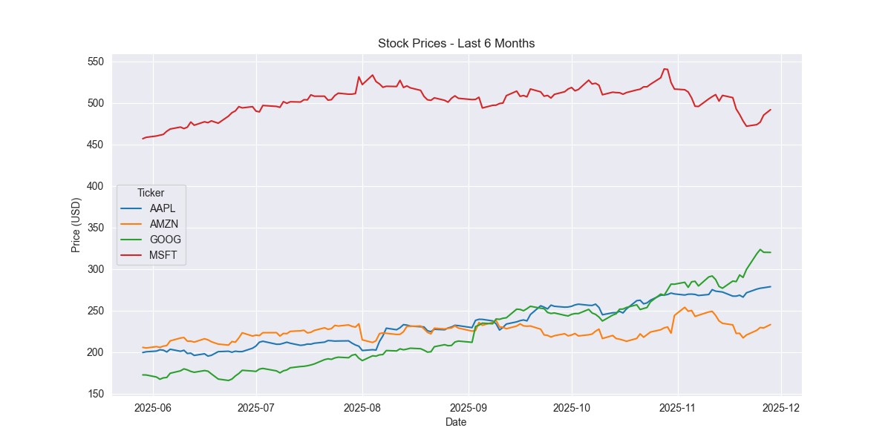

# FinTrack Dashboard

A lightweight Python project for fetching and visualizing stock prices.  
Currently focused on **Apple (AAPL)** or any tickers you define in your `.env` file.

---

## Features
- Fetch stock price data using [Yahoo Finance](https://pypi.org/project/yfinance/).
- Plot clean line charts with [Seaborn](https://seaborn.pydata.org/) and [Matplotlib](https://matplotlib.org/).
- Supports **multiple tickers** defined in `.env` (e.g., `TICKERS=AAPL,MSFT,GOOG`).

---

## Setup

1. **Clone the repo**
2. Create a virtual environment:
   ```bash
   python3 -m venv venv
   source venv/bin/activate   # macOS/Linux
   venv\Scripts\activate      # Windows
   ``` 
3. Install dependencies
   ```bash
    pip install -r requirements.txt
   ```
4. Create a .env file in the project root
   ```env
   TICKERS=AAPL,MSFT,GOOG
   PERIOD=6mo
   STYLE=darkgrid
   ```

## Usage
```bash
python agent.py
```

This will:
 - Fetch the stock prices for tickers in `.env`.
 - Print a preview of the data.
 - Plot a line chart showing each ticker’s closing price trend.

## 📊 Example Output

